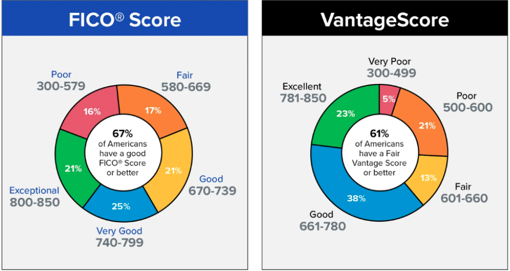

# Bank Account

In the U.S., there are two primary types of bank accounts: checking accounts and savings accounts. Each account serves a different purpose and understanding the difference is the first step towards managing your money effectively.

* **Checking accounts are** designed for frequent transactions. This is the account where you might receive direct deposits from a job, make purchases using a debit card, write checks, or withdraw cash. Checking accounts are ideal for managing everyday spending and bill payments.
* **Savings accounts** are meant for saving money. They often provide interest, which means your money grows over time. Savings accounts are ideal for emergency funds or saving up for future expenses. Typically, you wouldn't make daily transactions from this account.

<table>
  <tr>
   <td>
   </td>
   <td>
Checking Accounts
   </td>
   <td>Saving Accounts
   </td>
  </tr>
  <tr>
   <td>Primary Purpose
   </td>
   <td>Used for daily transactions. This is the account where your paycheck might be deposited and from which you'd pay bills or make purchases.
   </td>
   <td>Designed for saving money over the longer term.
   </td>
  </tr>
  <tr>
   <td>Best for
   </td>
   <td>Everyday use, including receiving direct deposits, paying bills, and making debit card purchases.
   </td>
   <td>Storing money you want to save for the future, while earning interest.
   </td>
  </tr>
  <tr>
   <td>Access to Funds
   </td>
   <td>Usually comes with checks, a debit card, and online access for easy payments and withdrawals.
   </td>
   <td>Provides limited access to funds. You might not receive a debit card or checkbook for a savings account. Withdrawals are usually made in person, at an ATM, or by transferring to a checking account.
   </td>
  </tr>
  <tr>
   <td>Interest
   </td>
   <td>Generally, checking accounts do not offer interest. If they do, the rate is often very low.
   </td>
   <td>Savings accounts pay interest on the balance, helping your money grow over time.
   </td>
  </tr>
  <tr>
   <td>Fees
   </td>
   <td>May have monthly maintenance fees, though these can often be waived if you meet certain requirements (like a minimum balance or a certain number of transactions per month).
   </td>
   <td>May have monthly maintenance fees, though these can often be waived if you maintain a minimum balance.
   </td>
  </tr>
  <tr>
   <td>Transaction Limits
   </td>
   <td>Typically, there are no limits on the number of transactions you can make each month.
   </td>
   <td>Federal law in the U.S. limits certain types of withdrawals or transfers to six per month. Banks may charge a fee if you exceed this limit.
   </td>
  </tr>
</table>

**Note:** In many cases, you can open an account with both checking and saving accounts.

**Note:** Bank account is different from a credit card account.

## Choosing a Bank

Some of the major national banks include Bank of America (BoA), Wells Fargo, Citibank, and JPMorgan Chase. These banks have branches and ATMs spread throughout the country. Alternatively, you may choose to bank with a regional bank, which may have fewer locations but offer more personalized service. Credit Unions are another option; they are member-owned and often offer lower fees.

Some of the famous banks providing services to international students:

* Local campus branches of Credit Union
* Wells Fargo
* Bank of America

**Note:** The bank branches that are located close to campuses are more aware of the process, e.g. required documentation, for international students. Unfortunately, it is possible that the staff of branches that are not close to university campuses and do not have international students as their usual customers and are not aware of the process for them, thus they may provide inaccurate information.

## Opening a Bank Account

You can check the promotions for opening an account on the internet (They may have referral bonus and also welcome bonus). As an example, Wells Fargo used to offer a $300 bonus as reward for opening a checking account. However, the promotions and their amount are seasonal and may change throughout the year.

For opening an account, you can set an appointment through the bank’s website. Some banks might not accept walk-in customers. To open a bank account in the U.S., you'll typically need the following:

* **Identification:** A passport will usually suffice for international students. Please refer to Identification section.
* **Proof of Address:** This can be a lease agreement or utility bill. &lt;REF-PROOF-ADDRESS>
* **Initial Deposit:** Some banks require you to deposit a minimum amount to open an account. &lt;REF-DIRECT-DEPOSIT>
* Social Security Number (SSN) or Individual Taxpayer Identification Number (ITIN): Some banks may require this, but not all. As an international student, you can open a bank account without an SSN.  

## Direct Deposit

Direct deposit is a method used to transfer money electronically from one bank account to another. This is typically how employers pay wages in the U.S., directly depositing your salary into your checking account. To set this up, you will need to provide your employer with your bank account number and the bank's routing number.

## Debit Card

Once your bank account is open, you'll typically receive a debit card. This card is linked directly to your checking account. When you use it for purchases or to withdraw cash from an ATM, the money is immediately deducted from your account.

Your debit card will come with a Personal Identification Number (PIN) which you'll use for transactions, especially when withdrawing cash from an ATM. It's crucial to keep this number private to protect your account.

### Features and Benefits of Debit Cards

* Convenience: A debit card is easy to carry and accepted at most places, making it convenient for everyday purchases.
* Safety: It's safer than carrying large amounts of cash.
* Controlled Spending: Since a debit card deducts money directly from your checking account, it can help prevent overspending. You can only spend as much as you have in your account.
* Online Shopping and Bill Payment: You can use your debit card for online purchases or to set up automatic payments for recurring bills.

### Safety

* **Protect your PIN:** Don't share your PIN with anyone and avoid writing it down. When using an ATM or a card reader, make sure nobody can see your PIN as you enter it.
* **Monitor Your Account:** Regularly check your account balance and transactions. If you notice any unauthorized transactions, report them to your bank immediately.
* **Know Your Balance:** Keep track of how much money you have in your account. If you use your debit card and don't have sufficient funds in your account, you may incur overdraft fees.

### ATM Use

ATMs (Automated Teller Machines) allow you to withdraw cash, deposit money, and sometimes even perform other banking tasks. Keep in mind that using ATMs from a bank other than your own may result in additional fees.

### Debit Card vs. Credit Card

It's important to understand that debit cards and credit cards work differently. While debit cards deduct money from your bank account immediately, a credit card allows you to borrow money up to a certain limit in order to make purchases. You then repay this money at the end of your billing cycle. Using a credit card can help you build credit history, but it also comes with the risk of high interest and fees if not managed properly.

### Tracking Your Transactions and Balances

Regularly review your bank statements (either online or paper statements) to check your transactions, including your debit card spending. This will help you spot any errors or fraudulent activity, keep track of your spending, and avoid overdrawing your account.

## Checkbook

When you open a checking account, your bank will provide you with a checkbook. Each check contains account information and space for you to specify a payment amount and recipient. Checks can be used for various purposes, including paying rent, bills, or paying someone without needing to handle cash.

**Note:** Some banks may charge for providing checkbooks.

**Note:** After opening a new bank account, it takes a few days for the bank to provide you with the new checkbook. On such occasions, you can ask the bank clerk to provide you with a few checks.

### Writing a Check

Writing a check correctly is crucial to ensure the payment goes through and to prevent any potential misuse. Here are some key elements of a check

* **Payee Line:** Here is where you write the name of the person or company to whom you're making the payment.
* **Amount Box and Amount Line:** You write the payment amount in numbers in the box and in words on the line to ensure there's no confusion about the amount you're paying.
* **Memo Line:** This is optional but it can be helpful to note what the payment is for.
* **Signature Line:** You sign the check here. Without your signature, the check won't be valid.

Here's a simple step-by-step process to write a check:

* Write the date on the line at the top right-hand corner.
* On the "Pay to the Order of" line, write the name of the person or company you're paying.
* In the box labeled "$", write the amount of the payment in numbers.
* On the line under "Pay to the Order of", write the amount in words.
* Use the "Memo" line to note what the payment is for (like "Rent for August").
* Sign your name on the line in the bottom right corner.

Always make sure the numeric and written amounts match.

### Using Your Checkbook Responsibly

It is important to follow these guidelines to make sure you can manage your bank account and checks:

* **Record All Transactions:** Keep track of all the checks you've written in the register that comes with your checkbook or in your own record system. This will help you avoid bouncing checks and overdraft fees.
* **Safeguard Your Checkbook:** Keep your checkbook in a secure place and never pre-sign checks. If your checkbook is lost or stolen, contact your bank immediately.
* **Review Your Bank Statements:** Compare your check register to your bank statement each month to spot any discrepancies or unauthorized transactions.

### Electronic Checks

Some banks offer the ability to write electronic checks, or eChecks. This is a form of payment made via the internet designed to perform the same function as a conventional paper check. Because the information is transmitted digitally, an eCheck is often more secure and faster.

## Understanding Bank Fees

Banks often charge fees for their services. Some banks may waive certain fees if you meet specific requirements, such as maintaining a minimum balance or making a certain number of transactions each month. It's important to understand the fees associated with your account to avoid any surprises.

* **Monthly Maintenance Fee:** Some banks charge this fee for the upkeep of your account, though it can often be waived if certain conditions are met.
* **Overdraft Fee:** If you spend more money than you have in your checking account, the bank may cover the difference and charge you an overdraft fee.
* **ATM Fee:** While using an ATM from your bank is usually free, using an ATM from another bank may result in a fee.
* **Foreign Transaction Fee:** Some banks charge a fee for transactions made outside of the U.S.

## Money Transfer

### ATM

Automated Teller Machines (ATMs) can be found almost everywhere in the U.S., and they allow you to deposit cash or checks, withdraw money, and sometimes even pay bills. Your bank's ATMs usually offer free services, but using another bank's ATM might result in charges.

### Bank Transfers

Direct bank transfers are a reliable method to transfer money. You can do this online, on the phone, or in person at the bank. You’ll need the recipient's bank account number and routing number to complete the transfer.

### Online Applications

* **PayPal** is one of the most popular online payment systems. It allows you to transfer money to others using their email address or phone number. PayPal also lets you make purchases from online merchants and can be used internationally.
* **Venmo** is a mobile payment service owned by PayPal. It provides a simple way to send money to friends or family from your smartphone. Payments and requests can be made through the app, and you can link your Venmo account to a bank account, credit card, or debit card.
* **Cash App**, developed by Square Inc., is a mobile payment service that allows users to transfer money to one another using a mobile phone app. It also offers features like the ability to invest in stocks and Bitcoin.
* **Zelle** is a U.S.-based digital payments network owned by several of the country's largest banks. It allows for money to be sent from one bank account to another in minutes, using only a recipient's email address or mobile number. Most major U.S. banks offer Zelle integration within their mobile banking apps.

## International Money Transfers

&lt;TODO-SANCTIONS>

### Wire Transfers

Wire transfers are a reliable, though sometimes costly, method for international money transfers. They can be done through your bank or a specialized service like Western Union or MoneyGram.

### TransferWise (Wise)

Wise is a popular online platform for international money transfers. It offers competitive exchange rates and low fees by using two local transfers instead of one international transaction.

## FAQ

* Does the bank offer student accounts? Some banks offer accounts specifically for students, which may come with benefits like lower fees.
* Do I need to consider any factors when choosing the bank account my income is deposited to?

# Credit Score

In simple words, credit score is a numerical representation (a three-digit number) of your creditworthiness, providing lenders and financial institutions with an assessment of the risk of extending credit to you. In the United States, credit scores are generated by **credit bureaus** based on the information in your **credit report**. The most commonly used credit scoring models are the FICO Score and VantageScore. These scores typically range from 300 to 850, with a higher score indicating better creditworthiness.

```
Social Security Number (SSN) and Credit Score: SSN is like an ID, a unique identifier, used to track credit activity, including credit accounts, loans, and payment history, which collectively contribute to the formation of a credit report. 
```

## Understanding Credit

Credit is a financial arrangement that allows you to borrow money or access goods and services with a promise to repay the amount later, usually with interest. It is like receiving something of value now and agreeing to pay for it in the future.

When you use credit, you are essentially borrowing money from a lender, such as a bank, financial institution, or credit card company. The lender trusts that you will repay the money based on the terms and conditions agreed upon, which often include paying back the borrowed amount over time, along with an additional fee called interest.

There are different types of credit that you might encounter:

* **Loans:** These are specific amounts of money borrowed from a lender that you must repay in fixed installments over a set period. Common examples include car loans, student loans, and home mortgages.
* **Credit Cards:** Credit cards allow you to make purchases on credit, up to a predetermined credit limit. You can choose to pay the full balance or a minimum amount each month. If you don't pay the full balance, interest will be added to the remaining amount.
* **Lines of Credit:** This is a pre-approved amount of credit that you can access as needed, similar to a credit card. However, it is typically used for larger expenses or emergencies.

```

Credit, Credit Report, and Credit Score
"Credit" refers to the ability to borrow money, while a "credit report" is a detailed record of a person's credit history, including their borrowing and payment behavior. The "credit score" is a numerical representation of the information in the credit report.

```

### Credit Report

A credit report is a detailed record of an individual's credit history and financial behavior. It serves as a crucial document that provides lenders and other authorized entities with insight into a person's creditworthiness and how they manage their financial obligations. Credit reports are compiled and maintained by credit bureaus, also known as credit reporting agencies, such as Experian, Equifax, and TransUnion.

**Information recorded in a credit report are:**

* Credit Accounts: Credit reports include information about various credit accounts that an individual holds. This includes credit cards, mortgages, auto loans, personal loans, student loans, and other lines of credit.
* Payment History: The credit report records the payment history associated with each credit account. It shows whether payments were made on time or if there were any late payments or delinquencies.
* Credit Utilization: Credit reports indicate the credit utilization ratio for each credit card account. This ratio represents the percentage of available credit that a person is using and is an essential factor in credit score calculations.
* Public Records: Certain financial events, such as bankruptcies, tax liens, judgments, and foreclosures, are considered public records and are included in the credit report.
* Credit Inquiries: Credit reports show a list of inquiries made by lenders when an individual applies for credit. There are two types of inquiries: hard inquiries and soft inquiries. Hard inquiries made by lenders when considering a credit application may have a temporary negative impact on the credit score, while soft inquiries, like checking one's own credit report, do not affect the score.
* Personal Information: The credit report includes personal information such as name, address, date of birth, Social Security number, and employment history. It helps verify the individual's identity and may be used to match their credit history to the correct person.

**Information not recorded in a credit report:**

* Income: Credit reports do not include information about an individual's income or salary. Lenders typically consider income separately when evaluating credit applications.
* Bank Account Balances: Credit reports do not contain details about an individual's bank account balances or transactions. This information is not relevant to creditworthiness assessments.
* Race, Religion, Nationality, and Marital Status: Credit reports do not contain any personal information related to an individual's race, religion, nationality, or marital status. This information is not used in credit evaluations.
* Criminal Records: Credit reports do not include information about an individual's criminal history. Credit bureaus are responsible for credit-related information only.
* Medical History: Credit reports do not contain any information about an individual's medical history, health status, or medical expenses.

### Credit Bureaus

Credit agencies, also known as credit reporting agencies or credit bureaus, are independent organizations that collect and maintain credit information on individuals and businesses. These agencies play a crucial role in the financial industry by providing credit reports and credit scores to lenders, landlords, employers, and other authorized entities. The information gathered by credit agencies allows these entities to assess the creditworthiness of individuals and make informed decisions about granting credit, offering loans, or extending other financial services. Important credit agencies in the U.S. are:

* Experian
* Equifax
* TransUnion

### Credit Score Calculation

Credit scores are calculated based on the information found in your credit report. Various factors are considered in this calculation, such as your payment history, credit utilization, length of credit history, types of credit used, and recent credit inquiries. Each of these factors holds a different level of importance in determining your overall credit score.

## Credit Scoring Models

In the United States, two primary credit scoring models are widely used to calculate credit scores: FICO Score and VantageScore. Both models assess an individual's creditworthiness based on information from credit reports, but they have distinct methodologies and may weigh factors differently.

### FICO Score

FICO (Fair Isaac Corporation) Score is one of the oldest and most widely recognized credit scoring models. It was developed by the Fair Isaac Corporation and is widely used by lenders to make credit decisions. FICO Scores range from 300 to 850, with higher scores indicating better creditworthiness.

**Key Features of FICO Score include:**

* FICO Scores primarily consider factors such as payment history, credit utilization, length of credit history, types of credit used, and recent credit inquiries.
* Payment history, especially on-time payments, carries significant weight in the FICO Score calculation.
* FICO Scores may consider both positive and negative credit information, including late payments, bankruptcies, and collections.

### VantageScore

VantageScore is a credit scoring model developed jointly by the three major credit bureaus: Experian, Equifax, and TransUnion. It was introduced as an alternative to the FICO Score and uses a different scoring range. VantageScores range from 300 to 850, just like FICO Scores.

**Key Features of VantageScore includes:**

* VantageScore uses similar factors as FICO Score, such as payment history, credit utilization, length of credit history, credit mix, and recent credit inquiries.
* However, VantageScore may place more emphasis on trending credit data, which considers recent credit behavior over time.
* VantageScore may also consider alternative data, such as utility and rent payments, to assess creditworthiness for individuals with limited credit histories.

### Differences Between FICO Score and VantageScore

While both FICO Score and VantageScore serve the same purpose of assessing creditworthiness, and they have similar scoring range, there are some differences between the two models:

* **Tri-Bureau vs. Bureau-Specific Models:** VantageScore creates a single tri-bureau model that can be used with a credit report from Experian, Equifax or TransUnion. However, FICO creates bureau-specific scoring models. So, while the latest FICO Score (version 9) might have one name, there are actually three slightly different FICO Score 9 models, one for each of the major credit reporting agencies.
* **Factors Weighting:** The weight given to specific credit factors may differ between the two models. For example, the importance of payment history and credit utilization may vary.
* **Weighting:** FICO gives more weight to payment history, while VantageScore's latest version emphasizes total credit usage and balances.


```

Other Credit Scoring Models
There are alternative credit scoring models developed by various companies and financial institutions. These models may consider different data sources and use unique algorithms to calculate credit scores.

```

```

Loan Specific Scoring Models
Some specialized models assess creditworthiness based on factors relevant to each specific type of loan. For example, Experian's FICO Auto Score, which is used for car loans, and FICO Mortgage Score, which is used for mortgage loans.

```

## Important Factors

Various factors contribute to your credit score, and understanding them will help you take actions to improve and maintain a good score. Credit scores are calculated using various factors and weighted differently depending on the scoring model. The factors commonly considered in credit score calculations include:




### Payment History

Your payment history is a crucial factor that heavily influences your credit score. Lenders want to see a track record of responsible credit management. Late payments, delinquencies, or accounts in collections can significantly impact your score negatively. Making consistent, on-time payments is vital for maintaining a good credit score.

### Credit Utilization

Credit utilization refers to the amount of credit you're using compared to the total credit available to you. This ratio has a significant impact on your credit score. It's recommended to keep your credit utilization below 30% of your available credit. High utilization can indicate a higher credit risk and potentially lower your credit score.

### Length of Credit History

The length of your credit history plays a role in determining your creditworthiness. Generally, a longer credit history is beneficial, as it provides more information for lenders to assess your credit behavior. This factor considers the age of your oldest account, the average age of all your accounts, and the time since your most recent activity on each account.

### Types of Credit

The types of credit you have, such as credit cards, loans, or mortgages, impact your credit score. A diverse mix of credit accounts, including both revolving credit (like credit cards) and installment loans (like car loans), can positively influence your score.

### New Credit Inquiries

When you apply for new credit, it generates a hard inquiry on your credit report. Multiple recent inquiries can indicate a higher credit risk. However, when you check your own credit or lenders perform soft inquiries for pre-approval purposes, they do not impact your credit score.

## Monitoring

Maintaining a good credit score is crucial for your financial well-being. Your credit score influences your ability to secure loans, obtain favorable interest rates, and even impacts your housing and employment opportunities. Regularly monitoring your credit score is essential for identifying potential issues and tracking your progress.

### Free Credit Reports by Credit Bureaus

Request free copies of your credit reports from the three major credit bureaus - Experian, Equifax, and TransUnion. Under federal law, you are entitled to one free credit report from each bureau every 12 months through AnnualCreditReport.com, the official website mandated by the U.S. government for free credit reports. Review these reports to ensure all information is accurate and up-to-date.

### Third Party Credit Monitoring Services

Consider enrolling in credit monitoring services offered by various financial institutions and credit bureaus. These services provide real-time access to your credit information and send alerts about significant changes or suspicious activity. Credit monitoring allows you to act promptly in case of any unexpected credit-related events. Here are some examples from these services:

* Most credit card online accounts
* CreditKarma website

### Monitor for Identity Theft

Regularly monitoring your credit can help you detect signs of identity theft or fraudulent activities. If you notice any unauthorized accounts or inquiries on your credit report, take immediate action to protect yourself from potential identity theft.

```
Set Reminders for Credit Check-ups Make it a habit to check your credit score regularly. Set up reminders to review your credit reports at least once a year or before applying for significant financial transactions, such as loans or credit cards.

```

### Check for Errors and Discrepancies

Thoroughly review your credit reports for errors, inaccuracies, or unfamiliar accounts. If you spot any discrepancies, promptly dispute them with the respective credit bureau to have the information corrected. Accurate credit reports are crucial for maintaining a reliable credit score.

### Track Credit Score Changes

Keep an eye on your credit score's fluctuations over time. Any significant changes in your score could indicate shifts in your credit behavior or potential errors on your credit report. Monitoring these changes helps you identify positive or negative trends in your credit health.

```
If you find any inaccuracies or errors in your credit report you can dispute them with the respective credit bureau to have them corrected. Additionally, focusing on responsible credit habits, such as making on-time payments, keeping credit utilization low, and avoiding excessive debt, will contribute to improving your credit score over time.

```

## Hard and Soft Inquiries

Hard inquiries are associated with credit applications and may impact your credit score temporarily, while soft inquiries are related to non-credit purposes and have no effect on your credit score. It's essential to be mindful of hard inquiries and apply for credit selectively to maintain a healthy credit profile.

<table>
  <tr>
   <td>
   </td>
   <td>Hard Inquiries
   </td>
   <td>Soft Inquiries
   </td>
  </tr>
  <tr>
   <td>Purpose
   </td>
   <td>Initiated when you apply for new credit, such as a credit card, loan, or mortgage.
   </td>
   <td>Non-credit reasons, like checking your own credit report, pre-approved credit offers, or background checks by employers.
   </td>
  </tr>
  <tr>
   <td>Effect on Credit Score
   </td>
   <td>Typically results in a small and temporary decrease in your credit score.
   </td>
   <td>No impact on credit score and have no negative consequences.
   </td>
  </tr>
  <tr>
   <td>Visibility
   </td>
   <td>Visible to other lenders and may raise concerns if multiple inquiries are made in a short period.
   </td>
   <td>Only visible to you and not accessible by other lenders or third parties.
   </td>
  </tr>
  <tr>
   <td>Impact Duration
   </td>
   <td>Remain on your credit report for up to two years but only affect your credit score for the first year.
   </td>
   <td>Do not stay on your credit report and have no lasting effect on your credit score.
   </td>
  </tr>
</table>

```
Multiple hard inquiries within a short period, especially if you apply for various types of credit, may raise concerns for lenders and could further lower your credit score.

```

```
When faced with credit inquiries during phone calls or online interactions, you can inquire or search to determine if it's a hard inquiry impacting your credit score or a soft inquiry with no effect on your credit standing.

```

## Uses of Credit Score

A good credit score is crucial for various financial tasks. Higher credit scores result in favorable borrowing terms, lower interest rates, higher credit limits, and better insurance premiums.

* **Credit Card Applications:** Credit card issuers use your credit score to determine eligibility and offer favorable terms.
* Loans - Personal, Auto, and Mortgage: Lenders assess credit scores to gauge creditworthiness and decide loan terms.
* **Rental Applications:** Landlords may use credit scores to evaluate potential tenants' financial responsibility.
* **Utility Services:** Some utility providers check credit scores before offering services.
* **Employment Opportunities:** In certain cases, employers may review credit history for specific roles.
* **Insurance Premiums:** Insurance companies use credit-based insurance scores to set premiums.
* **Additional Credit Applications:** Retail cards, student loans, and more may consider credit scores for approval and terms.

## International Students With No SSN

Typically, a SSN is required to build credit history, but alternative methods may be available for international students to establish credit without these identification numbers.

### Credit History with ITIN

While not as widely accepted as an SSN, some financial institutions may accept an ITIN to open a bank account or apply for a secured credit card. It's worth inquiring with different lenders or credit issuers about their policies regarding ITINs.

### Credit-Building Programs

Some financial institutions and credit bureaus offer programs specifically tailored to international students who lack an SSN or credit history. These programs may provide alternative ways to assess creditworthiness and start building credit. It's advisable to research and inquire with different institutions to see if they offer such programs.

### Credit Cards for International Students

Certain credit card issuers provide credit cards designed for international students who don't have an SSN or credit history. These cards may have specific eligibility criteria, such as being enrolled in a U.S. educational institution, and they often have lower credit limits and higher interest rates. Applying for these cards can be a viable option to start building credit.

### Credit Builder Loans (Secured Loans)

Credit builder loans, as mentioned earlier, are installment loans designed to help individuals establish credit. These loans may not require an SSN or credit history and can be a useful tool for building credit. Secured loans, where you provide collateral such as a deposit, may also be an option.

### Rent Reporting Services

Your rental payment history is typically not reported to credit bureaus unless you have an SSN or voluntarily choose to report it. However, some rent reporting services allow you to report your rental payments, even without an SSN. These services work with your landlord to verify your payment history and report it to credit bureaus, helping you build credit based on your rental record.

```
Different financial institutions and credit issuers may have varying requirements and programs to cater to individuals without an SSN or credit history. By exploring these alternatives and responsibly managing your finances, you can gradually build a positive credit history in the U.S.

```

## FAQ

* **International Student Credit Cards:** Some banks offer credit cards specifically designed for international students, making it easier to obtain without a credit history.
* **What should I do if I don’t have an SSN?**

# Credit Cards

A credit card is a plastic card issued by a bank or other financial institution. Unlike a debit card, which deducts money directly from your bank account when you make a purchase, a credit card allows you to borrow money from the card issuer up to a certain limit in order to buy goods or pay for services.

Consider a credit card as a type of loan: every time you use your credit card, you're borrowing money that you pledge to pay back. You can choose to repay the full amount borrowed at the end of a billing cycle, or you can carry over a balance to the next cycle. However, any balance that is not paid off will accrue interest. This is how the card issuer makes money.

The credit card is a powerful financial tool in the U.S., allowing for convenience, fraud protection, and the ability to build a credit history. But it's important to remember that it must be used responsibly to avoid incurring debt and high interest charges.

## Understanding The Key Terms

Understanding credit card use and management is crucial for financial well-being and responsible money handling. Familiarizing oneself with these key terms helps individuals to understand how credit cards work and avoid unnecessary charges.

<table>
  <tr>
   <td><strong>Key Terms</strong>
   </td>
   <td><strong>Description</strong>
   </td>
  </tr>
  <tr>
   <td>Annual Fees
   </td>
   <td>Some credit cards require the cardholder to pay a fixed amount annually to maintain the account.
   </td>
  </tr>
  <tr>
   <td>Credit Limit
   </td>
   <td>Maximum amount of money the credit card issuer allows you to borrow. It represents the cap on your spending and borrowing capacity with the card.
   </td>
  </tr>
  <tr>
   <td>APR
   </td>
   <td>Annual Percentage Rate (APR) is the interest rate charged on any outstanding balances if you don't pay your full credit card bill by the due date. It's expressed as an annual percentage, and a higher APR means you'll pay more in interest on unpaid balances.
   </td>
  </tr>
  <tr>
   <td>Minimum Payment
   </td>
   <td>Assuming that the total amount that you owe is a loan from the credit card issuer Minimum Payment is the monthly is the amount you have to pay to keep your account in good standing.
   </td>
  </tr>
  <tr>
   <td>Billing Cycle
   </td>
   <td>The period between two consecutive credit card statements, during which you make purchases and incur charges that will be reflected on your upcoming statement. It typically lasts around 30 days.
   </td>
  </tr>
  <tr>
   <td>Statement Balance
   </td>
   <td>The total amount you owe on your credit card as of the last billing cycle's closing date, which you need to pay by the due date to avoid accruing interest charges.
   </td>
  </tr>
  <tr>
   <td>Grace Period
   </td>
   <td>The time between your credit card statement closing date and the payment due date when you can pay your full balance without incurring interest charges on purchases made within that billing cycle. It usually lasts around 21 to 25 days.
   </td>
  </tr>
</table>

### Credit Limit

The credit limit is the maximum amount of money that a credit card issuer allows you to borrow on your credit card. It represents the highest balance you can carry on the card at any given time. For example, if your credit limit is $2,000, you can make purchases and accumulate balances on your credit card up to that amount. It's essential to manage your credit card spending responsibly and stay within your credit limit to avoid potential over-limit fees and negative impacts on your credit score.

### Annual Percentage Rate (APR)

APR stands for Annual Percentage Rate, and it represents the interest rate charged on outstanding credit card balances if you do not pay your full credit card bill by the due date. It's expressed as an annual percentage, indicating the cost of borrowing money over one year. For example, if your credit card has an APR of 18%, it means you'll be charged 18% interest on any remaining balance after the grace period ends. It's crucial to understand your credit card's APR, as it directly impacts the amount of interest you'll pay if you carry a balance on your card.

### Billing Cycle

A billing cycle is the specific period between two consecutive credit card statements. It typically lasts around 30 days and represents the timeframe during which you make purchases and incur charges using your credit card. At the end of the billing cycle, the credit card issuer will generate a statement that shows all the transactions made during that period, along with the total outstanding balance. The statement will also include the minimum payment due and the due date for making the payment. It's essential to keep track of your billing cycle to manage your credit card usage and ensure timely payments to avoid interest charges.

### Statement Balance

The statement balance is the total amount you owe on your credit card as of the last billing cycle's closing date. It includes all the purchases, balance transfers, cash advances, and any applicable fees or interest that have been posted to your account during that billing cycle. The statement balance is the amount you are required to pay by the due date specified on your credit card statement to avoid any late fees or additional interest charges. If you pay the statement balance in full by the due date, you won't incur any interest on the purchases made during that billing cycle.

### Grace Period

A grace period is the period of time between the end of a billing cycle and the payment due date on a credit card. During this time, you have the opportunity to pay your credit card balance in full without incurring any interest charges on your purchases. The grace period typically lasts around 21 to 25 days, giving cardholders a window to make timely payments. To take advantage of the grace period and avoid interest, it's essential to pay the full statement balance by the due date each month. However, keep in mind that grace periods usually do not apply to cash advances and balance transfers, which may start accruing interest immediately.

### Default on a Credit Card

Default on a credit card means not paying the required minimum by the due date. It leads to late fees, higher interest rates, credit score drop, collections, and potential legal action. Responsible management and communication with the issuer are key to avoid default.

## Understanding Credit Card Rewards

Rewards in the context of credit cards refer to the benefits or incentives that card holders earn for using their cards to make purchases. They serve as incentives from credit card companies to encourage consumer spending. These rewards can be cash back, points for goods or services, or travel miles. The more a cardholder uses their credit card, the more rewards they accumulate, which can be redeemed in accordance with the card's specific rewards program. While beneficial, it's important to understand the rewards structure and responsible spending.

### Cashback Rewards System

Rewarding mechanism that returns a percentage of the total amount spent on your card back to you. For instance, if a card offers 1% cash back on all purchases, you'll get $1 back for every $100 you spend.

However, it's important to note that cash back rewards can vary significantly among credit cards. Some cards offer a flat rate on all purchases, but many others have a tiered or bonus category system.

In a tiered system, different types of purchases earn different rates. For example, you might earn 3% cash back on groceries, 2% on gas, and 1% on all other purchases.

In a bonus category system, the categories that earn higher rates rotate periodically, typically every quarter. For instance, you might earn 5% on gas purchases one quarter, and then 5% on grocery store purchases the next quarter, with all other purchases earning a lower standard rate.

### Points Rewards System

In this system, cardholders earn points for every dollar they spend using their credit card. The amount of points earned per dollar can vary based on the card's terms and conditions. For example, you might earn 2 points for every dollar spent on dining and 1 point per dollar on all other purchases.

These points can then be redeemed for various goods, services, or experiences through the credit card's reward program. Common redemption options include merchandise, gift cards, travel bookings, or even as cash back in some cases. It's important to note that the value of each point can differ from one card to another, and may also depend on what you're redeeming them for.

### Miles Rewards System

Such systems are similar to points, but they're typically linked with travel-related purchases. For every dollar spent, cardholders earn a certain number of miles or travel points. The accumulation rate can vary based on categories - for instance, you might earn more miles for money spent on airfare or hotels.

These miles can then be redeemed for airfare, hotel stays, car rentals, and other travel-related expenses. Some credit cards have partnerships with specific airlines or hotel chains, allowing you to earn and redeem miles at a higher rate with those partners. Like points, the value of each mile can vary based on the credit card and redemption option.

### Earning Rewards

You earn rewards based on your spending with the card. Different cards have different reward structures. Some cards offer a flat rate on all purchases, while others offer higher rates on certain categories of spending, like dining, groceries, or gas.

### Redeeming Rewards

The process for redeeming rewards varies by card. You might be able to apply cash back directly to your credit card balance, deposit it into a bank account, or use it to purchase gift cards. Points or miles can typically be redeemed through the credit card company's rewards portal.

```
Understanding Terms and Conditions It's very important to understand the terms and conditions of your credit card rewards program. Some rewards cards have annual fees, and the rewards you earn might not justify the cost if you don't use the card regularly. Additionally, some cards require you to redeem your rewards within a certain timeframe or they may expire.
```

## Types of Credit Cards

Understanding the different types of credit cards can help you choose the one that best fits your needs and spending habits. While the features, benefits, and terms can vary greatly.

### Student Credit Cards

Designed specifically for students with limited credit history, making them accessible and suitable for international students. These cards often have lower credit limits and may offer rewards or benefits tailored to student spending habits. They can be a great starting point for building credit while offering some financial flexibility.

### Secured Credit Cards

Helpful for individuals with limited or poor credit history, as they require a cash deposit as collateral. For international students with no credit history in the U.S., secured cards provide an opportunity to establish credit by demonstrating responsible card use. The cash deposit acts as security for the card issuer, making it easier to obtain approval.

### Low-Interest Credit Cards

Useful for students who may occasionally carry a balance, as they offer lower ongoing interest rates. International students who anticipate carrying a balance on their credit card should consider low-interest cards to minimize interest costs.

### Retail Credit Cards

May be beneficial for students who frequently shop at specific retailers, as they offer rewards and discounts at those stores. While retail cards can provide extra savings, international students should carefully consider their spending habits and ensure the rewards align with their needs.

### Rewards Credit Cards

Can be attractive for students who want to earn rewards for their spending, but they should consider their specific spending habits. Rewards cards may offer cashback, points, or miles for eligible purchases, but students should choose one that complements their lifestyle and spending patterns.

### Cashback Credit Cards

Provides straightforward cash rewards for eligible purchases, which can be useful for general spending. International students who prefer simplicity and cash rewards may find cashback cards appealing for everyday expenses.

## Choosing the Right Credit Card

When choosing a credit card, start by evaluating your needs and spending habits—consider whether you want rewards, travel perks, or a low APR. Compare card types, features, and fees such as annual fees, interest rates, and introductory offers. Ensure the card matches your credit score and you have a fair approval chances. Stay mindful of your financial situation and only apply for cards that align with your budget. Carefully review terms and conditions before applying through official channels, keeping in mind that the best card varies based on individual preferences and goals.The main grounds for comparing credit cards are as follows:

* Interest Rates (APR)
* Fees (annual, late payment, foreign transaction, etc.)
* Rewards Programs
* Credit Limit
* Security and Customer Service

You can find which credit card suits you best by matching your needs and situation to these features, for instance if you'll pay off the balance each month, the APR may be less important than the rewards. If you'll carry a balance, you'll want a card with a low APR.

There are several reputable resources where you can compare credit cards to find the one that best suits your needs. To name a few,  <a href="http://www.nerdwallet.com">NerdWallet</a> and <a href="http://www.creditkarma.com">Credit Karma</a> are two popular credit card comparison websites.

## First Credit Card or Starting With No Credit

As an international student in the U.S., it is common to start with no credit history, which is often referred to as being "credit invisible." Having no credit history can make it challenging to establish credit and access certain financial opportunities. However, you can opt for student or secured credit cards which give you higher approval chances to start building your credit.

Remember, building credit takes time, and responsible financial habits are crucial. It's important to borrow and use credit wisely, make payments on time, and maintain a low credit utilization ratio (the amount of credit you use compared to your credit limit). With consistent effort and responsible

financial behavior, you can establish a positive credit history in the U.S. over time.

## Credit Card Pre Approval

After building your credit history you may receive credit card pre approval letters via mail or get it via online tools of these institutions. These pre approvals show higher approval chances yet they are not meant to be interpreted as a guarantee. Furthermore the credit card may not align with your needs and so never base your decision on the pre approval. Another very important point is that these pre approvals will not circumvent the hard inquiry after submitting the application.

## Applying for a Credit Card

You can apply for a credit card both in person and online, however it is always recommended to visit the card issuer’s website to check any available offers such as referral or sign up bonuses or possible pre approval checks. The application process consists of submitting the application form, presenting personal and possibly employment documents and a credit check.

It is important to note a credit check itself has a negative impact on your credit history therefore avoid multiple applications in a short period of time. Besides many stores offer retail credit cards which you will be asked at the check out to apply for in return for a discount. Same rules apply for these credit cards too, so do your research before agreeing.

## Healthy Credit Card Usage

Every time you are using your credit card to make a purchase you are taking a loan. You want to show you can responsibly handle your money. Key practices to follow are paying on time every time, paying more than the minimum payment, as a rule of thumb set a goal to keep the utilization ratio below 30%.

## Credit Card Statement

A credit card statement is a detailed document issued by the credit card issuer on a monthly basis. It provides a comprehensive summary of all the transactions and activities related to your credit card account during a specific billing cycle. Focus on learning the due date and the minimum payment, interest charges and fees that you would be able to avoid, and finally unauthorized transactions. If you see an unauthorized transaction on your credit card, contact your credit card issuer immediately. Report the unauthorized charge and request a dispute.

## FAQ

* How to apply for a credit card before having a SSN?
    * Different Banks set different policies for different situations, while most banks and credit unions require a SSN to review an application there are exceptions namely Bank of America. Still before submitting your application make sure you have decent approval odds.
* I am an international currently on a Fellowship therefore I do not have an SSN. How can I apply for a credit card?
    * Yes, if you are awarded a Fellowship, you will be granted an Individual Taxpayer Identification Number (ITIN). One can apply for a credit card using an ITIN.

# Tax

As an international student studying in the United States, understanding the U.S. tax system is crucial for managing your finances and complying with tax laws. This comprehensive guide provides detailed information about income and sales taxes, why filing a tax return is necessary, and the available tax preparation services like TurboTax and Sprintax.

## Understanding Tax System in the US

The United States operates on a federal system, which means that it's a union of individual states that retain their own sovereignty in many areas but come under a larger national government for certain shared responsibilities.

Taxes are a primary source of revenue for both the national and state governments. They are the price citizens pay for a structured society. They fund essential services like law enforcement, education, healthcare, roads, and more. They also support the needy through welfare programs and fund projects that boost economic growth.

In addition to the federal government, each state in the U.S. has its own government, and within states, there are local governments for counties, cities, and other municipalities. This layered system requires funding at every level, and taxes provide that essential support.

### Federal Taxes

Collected by the national government, these taxes primarily fund national defense, social services like Medicare and Social Security, interest on the national debt, and other federal programs.

### State Taxes

Each of the 50 states in the U.S. may impose its own set of taxes. These can include income taxes, sales taxes, and more. The revenue from state taxes is used to fund state-level services such as public education, health care, transportation, and state police forces.

```

Not all states levy all types of taxes. For example, some states might not have a personal income tax but might have higher sales or property taxes.

```

### Local Taxes

Within states, local governments (such as cities, counties, and districts) can also levy taxes. These typically fund services including local police departments, fire departments, public libraries, and municipal utilities. Property taxes are a common form of local tax, often used to fund public schools.

### Who Pays Taxes?

In the U.S., taxes are imposed on both individuals and businesses. For individuals, taxes are often based on income, consumption (like sales tax), or ownership (like property tax). Businesses are taxed on their income, sales, and sometimes specific industries have additional tax regulations.

### How Taxes Are Used?

Once collected, tax revenues are allocated to various sectors and projects as determined by budgets set at the federal, state, and local levels. These allocations are based on the needs and priorities of the government and can change based on economic conditions, political leadership, and societal needs.

## Types of Taxes

In the U.S., both the federal government and individual state governments levy various types of taxes.

### Income Taxes

Income tax is a tax imposed on your earnings, including wages, stipends, scholarships, fellowships, and other sources of income. In the U.S., income taxes can be levied at both the federal and state levels. As an international student, you may be subject to income tax on the money you earn while in the U.S. The amount of tax you owe depends on your total income, deductions, credits, and your residency status.

### Sales Taxes

Sales tax is a consumption tax imposed on goods and services at the point of purchase. Unlike income tax, sales tax is not based on your earnings but on what you spend. The sales tax rate can vary by state, and some states do not have sales tax at all.

### Property Tax

Property tax is primarily a local tax, levied on the value of property (mostly real estate). It helps fund local services like schools, roads, and fire departments.

* Homeowners: If you own a home, you'll pay property tax. The amount is based on the assessed value of your property and the tax rate in your area.
* Renters: While renters don't directly pay property tax, the cost is often indirectly included in rental prices.

### Other Taxes

There are numerous other taxes that you might encounter, depending on your specific circumstances:

* Estate Tax: This is a tax on the transfer of the estate of a deceased person. It's often referred to as the "death tax."
* Thresholds and Exemptions: There's a significant exemption threshold, meaning most estates won't owe this tax. But for very large estates, a portion may be taxable.
* Gift Tax: If you give someone a significant amount of money or property during your life, you might need to pay gift tax.
* Capital Gains Tax: This tax is levied on the profit made from selling an asset, like stocks or real estate.
* Excise Taxes: These are taxes on specific goods or activities, like gasoline, tobacco, and alcohol.

## Understanding Tax Return

The annual ritual of tax filing is a responsibility every earning individual and entity must undertake in the U.S. It's how you report your income, calculate how much tax you owe, and determine if you've paid the right amount throughout the year.

&lt;Something about SSN or ITIN>

### Why File a Tax Return

Filing a tax return is a legal requirement for individuals who earn income in the U.S., including international students. By filing a tax return, you report your total income and determine if you owe any taxes or if you are eligible for a refund. Even if your income is below the taxable threshold, it is still essential to file a tax return to claim any tax benefits or refunds you may be entitled to, such as tax treaty benefits or education-related credits.

### Residency Status

Your tax obligations as an international student depend on your residency status for tax purposes. International students are typically considered either non-resident aliens or resident aliens for tax purposes.

### Non-Resident Aliens

If you are in the U.S. on an F, J, M, or Q visa, you are generally considered a non-resident alien for tax purposes. Non-resident aliens are subject to specific tax rules, and their taxation is based only on U.S.-source income.

### Resident Aliens

If you meet certain criteria and pass the Substantial Presence Test, you may be classified as a resident alien for tax purposes. Resident aliens are subject to U.S. taxation on their worldwide income, just like U.S. citizens.

## Income Subject to Taxation

As an international student, you are required to report and pay taxes on income earned in the U.S. This income includes wages, stipends, scholarships, fellowships, and other sources of income. Non-cash income, such as tuition waivers, may also be subject to taxation.

### W-2 Form

IRS Form W-2 reports all taxable wages you received from USC during the calendar year, all taxes withheld from those wages, and a few other required fields. The form serves as an annual statement that enables you to file your personal income tax return with the Internal Revenue Service (IRS) as well as state and local authorities. Form W-2 reports only wages paid during the calendar year, regardless of when they were earned; that is, it does not include amounts earned but not paid until the next year. The university often provides W-2 forms to all employees by no later than January 31 each year. The best way to ensure timely and secure delivery is to register for online delivery of your W-2.

### 1042-S Form

The purpose of this form is to report U.S. taxable income and U.S. income tax withholding for scholarships, fellowships or grants awarded to students or postdoctoral fellows, and compensation for services rendered. The 1042-S will indicate the income code, which describes the type of income. In certain cases, you may receive multiple 1042-S forms or a W-2 form in addition to a 1042-S form. The income code is tied to your immigration status. A person on F-1 OPT who is faculty will be paid under income code 20, for example.

The form(s) is often mailed to you from your school by no later than January 31 of each year to the address that appears on your pay slip in Workday as of December 31 of the previous year.

### 1098-T Form

A 1098-T Form is provided to some students to notify them that they may be eligible for federal income tax credits. The majority of international students and scholars are not eligible to claim education expense tax credits on their federal tax forms as they are not US Citizens, Permanent Residents (PR), married to a U.S. citizen or PR, allowed to legally be claimed as a dependent by a US citizen or PR, or have not been in the US long enough to file taxes as a Resident for federal tax purposes.

## Tax Treaties

Many countries have tax treaties with the U.S. that may affect your tax liabilities and exemptions. These treaties aim to prevent double taxation and provide specific tax benefits for international students and scholars. Check if your home country has a tax treaty with the U.S. to understand any tax benefits you may be eligible for.

## Tax Withholding

If you are receiving taxable income, such as wages from a job, your employer may withhold taxes from your paycheck. Ensure you provide a completed Form W-4 to your employer to determine the correct amount of tax withholding.

## Resources and Assistance

Navigating U.S. tax laws can be complex, and seeking professional tax advice is recommended. Many colleges and universities offer tax workshops or resources specifically tailored to international students. Additionally, the Internal Revenue Service (IRS) provides online resources and publications to help you understand your tax obligations.

Remember, tax compliance is essential to avoid potential penalties and maintain your legal status as an international student in the U.S. Always keep records of your income, expenses, and relevant tax documents to facilitate the tax filing process.

### Tax Preparation Services

Navigating the complexities of the U.S. tax system can be challenging, but several tax preparation services can assist you in accurately filing your taxes. Two popular options for international students are:

### TurboTax

TurboTax is a user-friendly online tax preparation software that guides you through the tax filing process step by step. It helps you identify relevant tax deductions, credits, and treaty benefits you might be eligible for. TurboTax offers versions specifically designed for non-resident aliens, making it suitable for international students.

### Sprintax

Sprintax is a specialized tax software designed specifically for non-resident aliens, including international students and scholars. It helps you determine your tax residency status, prepares the necessary tax forms (such as Form 1040-NR), and ensures you claim all available tax benefits.

Using these tax preparation services can streamline the tax filing process, reduce the risk of errors, and help you identify potential tax savings.

Remember, staying compliant with U.S. tax laws is essential for maintaining your legal status as an international student. It is advisable to gather all relevant tax documents, keep records of your income and expenses, and seek professional advice if you encounter complex tax situations. By filing your taxes accurately and on time, you can avoid penalties and make the most of any tax benefits available to you.

## Filing Tax Returns

Every year, you're required to file a tax return, which is a report submitted to the Internal Revenue Service (IRS). The tax year runs from January 1 to December 31, and tax returns are typically due by April 15 of the following year.

### Non-Resident Aliens

Non-resident aliens must file Form 1040-NR or 1040-NR-EZ (U.S. Nonresident Alien Income Tax Return) by the tax deadline, which is usually April 15th. You are required to report all U.S. income, including any scholarships or grants that are taxable.

### Resident Aliens

Resident aliens generally must file Form 1040 (U.S. Individual Income Tax Return) by the tax deadline. As a resident alien, you are required to report worldwide income, including income earned outside the U.S.
